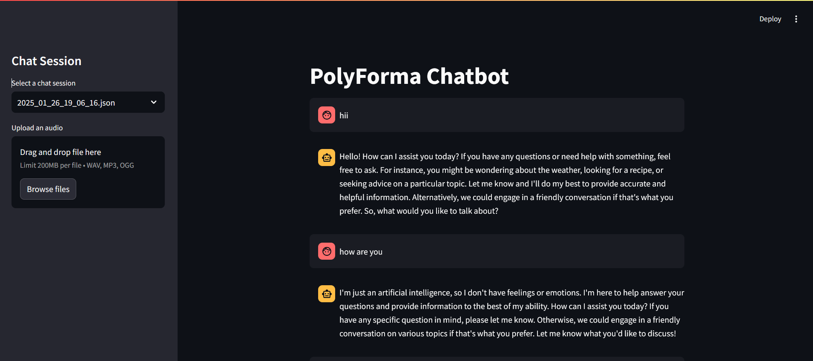

# PolyForma ChatBot 🤖🎤
 
*A multimodal chatbot supporting text/audio input with conversation history and audio summarization*



## Table of Contents
- [Features](#features-)
- [Tech Stack](#tech-stack-)
- [Installation](#installation-)
- [Usage Guide](#usage-guide-)
- [Project Structure](#project-structure-)
- [Key Functionalities](#Key Functionalities-)
- [License](#license-)
- [Acknowledgments](#acknowledgments-)
- [Contact](#contact-)

## Features ✨

### Input Modes
- **📝 Text Chat**: Natural language interactions
- **🎙️ Voice Input**: Real-time speech-to-text conversion
- **📁 Audio Upload**: Process pre-recorded audio files

### Core Capabilities
- **🗂️ Session Management**: 
  - Auto-saving conversation history
  - Session-specific context tracking
- **📑 Audio Summarization**:
  - Generate text summaries from audio files
  - Supports MP3/WAV formats (up to 25MB)
- **🧠 AI Integration**:
  - Mistral-7B for intelligent responses
  - Whisper AI for speech processing
  - BAAI embeddings for semantic analysis

## Tech Stack 🛠️

| Component              | Technology                          | Version/Model                  |
|------------------------|-------------------------------------|---------------------------------|
| Language Model         | Mistral                             | 7b-instruct-v0.2.Q5_K_M        |
| UI Framework           | Streamlit                           | 1.28+                          |
| Text Embeddings        | BAAI                                | bge-large-en-v1.5              |
| Speech-to-Text         | OpenAI Whisper                      | small                          |
| Core Libraries         | Hugging Face Transformers           | 4.30+                          |
| Audio Processing       | Librosa/PyAudio                     | 0.10+                          |

## Installation 💻

### Requirements
- Python 3.8+
- FFmpeg (`sudo apt install ffmpeg` for Linux)
- 8GB RAM (16GB recommended)

### Setup Guide

1. **Clone Repository**
   ```bash
   git clone https://github.com/your-username/PolyForma-ChatBot.git
   cd PolyForma-ChatBot
   ```

2. **Initialize Virtual Environment**
    ```bash
    python -m venv venv
    source venv/bin/activate  # Linux/Mac
    venv\Scripts\activate     # Windows
    ```

3. **Install Dependencies**
    ```bash
    pip install -r requirements.txt
    ```
4. **Model Setup**
 - Download Mistral-7B model (official source)
  
 - Place `mistral-7b-instruct-v0.2.Q5_K_M.gguf` in the `/models` directory.

 - Other models auto-download on the first run.


5. **Launch Application**
     ```bash
    streamlit run app.py
    ```
    

## Project Structure 📂

```bash
  PolyForma-ChatBot/
├── models/ # Local model storage
│ └── mistral-7b-instruct-v0.2.Q5_K_M.gguf # Quantized LLM
├── audio_handler.py # Voice processing
├── llm_processor.py # Model interactions
├── session_manager.py # History tracking
├── app.py # Main application
└── requirements.txt # Dependency list
```


## Key Functionalities 🚀

- **Text and Audio Input**  
  Integrates natural language processing (NLP) and speech recognition for seamless interaction.

- **Session Persistence**  
  Saves each session’s history to ensure continuity in user interaction.

- **Audio Summarization**  
  Transforms long audio content into concise summaries using state-of-the-art models.

## Future Enhancements

- Integration of multilingual support for global reach.
- Advanced customization options for conversation flow.
- Enhanced summarization capabilities with keyword extraction.

## Contributions

Contributions are welcome! Please fork the repository, make changes, and submit a pull request.

## License

This project is licensed under the [MIT License](LICENSE).

## Acknowledgments

- **Mistral-7B-Instruct**: For powering conversational AI.
- **BAAI**: For their exceptional embedding model.
- **OpenAI**: For the Whisper model used in audio-to-text conversion.
- **Streamlit**: For providing a simple and effective way to build the user interface.
- **Hugging Face**: For enabling seamless integration of cutting-edge NLP models.
